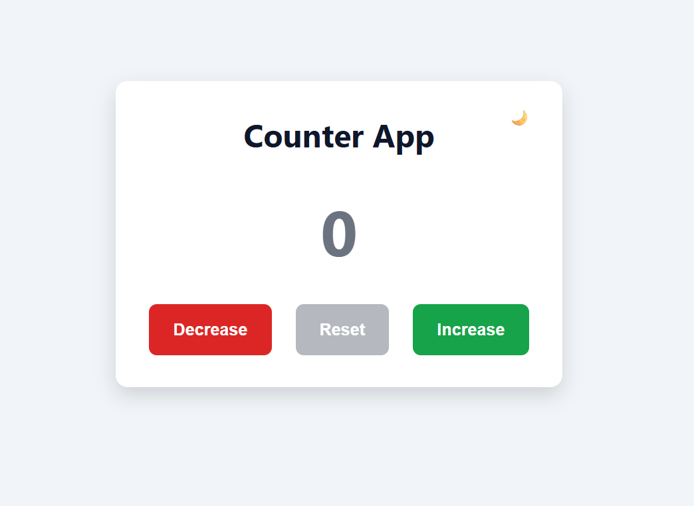
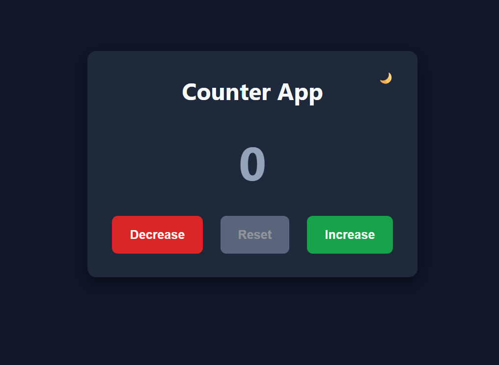

# 🚀 Counter App

## 🌐 Live Demo

👉 https://ulaserden.github.io/counter-app/

A modern, responsive Counter Application built with Vanilla JavaScript.

This project was developed to strengthen my understanding of JavaScript fundamentals, DOM manipulation, responsive design, modular architecture, and modern frontend development practices.

---

## ✨ Features

- ➕ Increase counter
- ➖ Decrease counter
- 🔄 Reset counter
- 🎨 Dynamic counter colors
- 🌙 Dark / Light Mode
- 📱 Responsive Design
- 📦 Modular JavaScript (ES Modules)
- 🎯 Clean and maintainable code structure

---

## 🛠 Technologies

- HTML5
- CSS3
- JavaScript (ES6+)
- CSS Variables
- Flexbox
- Responsive Design
- ES Modules

---

## 📂 Project Structure

```text
counter-app/
│
├── index.html
├── README.md
├── css/
│   ├── variables.css
│   ├── base.css
│   ├── components.css
│   ├── responsive.css
│   └── theme.css
│
├── js/
│   ├── app.js
│   ├── counter.js
│   └── theme.js
│
└── assets/
```
## 📸 Preview



---

## 🚀 Getting Started

Clone the repository:

```bash
git clone <repository-url>
```

Open the project with **Live Server**.

---

## 📚 What I Learned

During this project, I practiced:

- Semantic HTML
- CSS Variables (Design Tokens)
- Responsive Design
- Flexbox
- DOM Manipulation
- Event Handling
- State Management
- Modular JavaScript (ES Modules)
- Dark Mode implementation
- Project organization

---

## 🔮 Future Improvements

- Keyboard shortcuts
- Counter animation
- Save counter using Local Storage
- Accessibility improvements
- Unit tests

---

# 🇹🇷 Counter App

Modern ve responsive bir sayaç uygulaması.

Bu proje, JavaScript temellerini, DOM manipülasyonunu, responsive tasarımı, modüler JavaScript yapısını ve modern frontend geliştirme yaklaşımını geliştirmek amacıyla hazırlanmıştır.

---

## ✨ Özellikler

- Sayıyı artırma
- Sayıyı azaltma
- Sıfırlama
- Dinamik renk değişimi
- Dark / Light Mode
- Responsive tasarım
- ES Modules kullanımı
- Temiz ve sürdürülebilir kod yapısı

---

## 🛠 Kullanılan Teknolojiler

- HTML5
- CSS3
- JavaScript (ES6+)
- CSS Variables
- Flexbox
- Responsive Design
- ES Modules

---

## 📂 Proje Yapısı

(İngilizce bölümdeki yapı geçerlidir.)

---

## 🚀 Kurulum

Projeyi klonlayın ve Live Server ile çalıştırın.

---

## 📚 Bu Projede Öğrendiklerim

- Semantic HTML
- Responsive Design
- CSS Variables
- Flexbox
- DOM Manipulation
- Event Listener kullanımı
- State Management
- ES Modules
- Dark Mode
- Profesyonel proje organizasyonu

---

## 🔮 Gelecekte Eklenecek Özellikler

- Klavye kısayolları
- Sayaç animasyonları
- Local Storage desteği
- Accessibility geliştirmeleri
- Unit Test

---

## 👨‍💻 Author

**Melik Ulaş Erden**